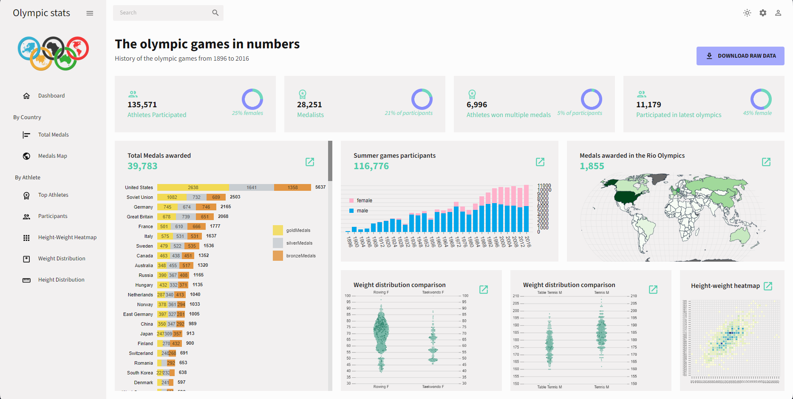

# Olympic Games Statistics Website

This project is a full-stack RESTful application that provides some statistics and data visualizations about the modern Olympic Games. The application uses a Java Spring Boot backend, a MySQL database, and a React frontend.

https://olympic-medalists.onrender.com

## Features

- View historical data and statistics, including medal distribution by country.
- Browse Olympic Games data (e.g., most acomplished athletes by country and sport).
- Interactive charts and data visualizations.

## Acknowledgements

This project was created thanks to the beautiful dataset from rgriffin on kragle.

https://www.kaggle.com/datasets/heesoo37/120-years-of-olympic-history-athletes-and-results/data

## Technologies Used

### Backend
- **Java 20**: Programming language used for the backend.
- **Spring Boot**: Framework for building the backend RESTful API.
- **Spring Data JPA**: For data access and integration with MySQL.
- **MySQL**: Relational database for storing Olympic Games data.

### Frontend
- **React**: JavaScript library for building the user interface.
- **Material UI**: A popular React component library providing pre-designed and customizable components, for a modern and responsive user interface.
- **React Router**: For navigation and routing within the web application.
- **Axios**: For making HTTP requests to the backend API.
- **nivo**: Libraries for creating data visualizations.

### Development Tools
- **Maven**: For building and managing dependencies in the backend.
- **Node.js & npm**: For managing frontend dependencies and running the React development server.
- **Postman**: For testing API endpoints.
- **Docker**: For containerizing the application (optional).
